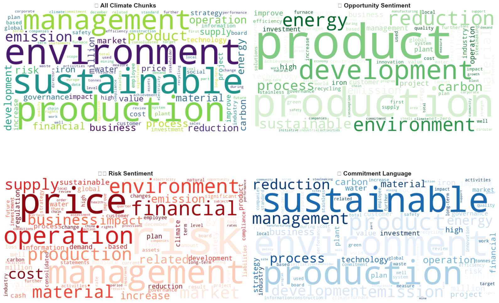

# SuSteelAible

Analyzing decarbonization pathways in the EU steel industry through integrated emissions data and corporate sustainability report analysis.




## Overview

This project combines **quantitative emissions analysis** with **qualitative text analysis** of ~200 corporate sustainability reports (2013–2025) to understand technology lock-in, climate commitments, and decarbonization barriers in European steel.

**Key findings:**

- Technology choice (BF-BOF vs EAF) explains ~79% of emissions variance — the single largest driver
- Process emissions (Scope 1) remain largely stable; real progress comes from grid decarbonization (Scope 2)
- Carbon prices rose 17× from 2013–2023 while EU steel emission intensity stayed flat — a structural technology lock-in problem, not a pricing problem
- Policy interventions (ETS, CBAM, Green Deal) show no significant within-firm intensity reductions; market forces (coal/carbon prices) show lagged Granger-causal effects
- ClimateBERT analysis of sustainability reports reveals trends in climate discourse specificity, commitment language, and net-zero focus across 15 companies


## Quick Start

```bash
# Clone repository
git clone git@github.com:am0ebe/SusteelAible.git
cd SusteelAible

# Create virtual environment
python3.11 -m venv .venv
source .venv/bin/activate  # Linux/Mac
# .venv\Scripts\activate   # Windows

# Install as package
pip install -e .

# Download spaCy language model
python -m pip install -v https://github.com/explosion/spacy-models/releases/download/en_core_web_sm-3.8.0/en_core_web_sm-3.8.0-py3-none-any.whl

# Extract EDA data + BERT cache
unzip data.zip
# → data/EDA/   (emissions, external drivers, EU ETS data)
# → cache/      (preprocessed BERT JSONs for all 197 reports)

# (Optional) Add Groq API key — required for RAG extraction and topic labeling (sections 3 & 4)
echo 'GROQ_API_KEY=your-key-here' > .env
```

✅ **Done!** You can now run all analysis notebooks. The BERT cache lets you skip the slow preprocessing step and jump directly to RAG extraction or topic modeling.


## Source Reports (Optional)

The original sustainability reports (~1.6 GB) are available as a separate download — only needed if you want to rerun preprocessing from scratch.

**Download:** <https://github.com/am0ebe/SusteelAible/releases/download/v1.1-data/reports.zip>

```bash
unzip reports.zip
# → data/reports/   (source PDFs, organized by company)
```


<details>
<summary><h2 style="display: inline; cursor: pointer;">EDA & Modeling</h2></summary>

### Data

All data files are included in `data.zip` and extract to `data/EDA/`:

| File | Contents |
|------|----------|
| `emissions_and_production_technology.xlsx` | Company-level emissions (Scope 1+2), production volumes, technology type — 16 companies, 2013–2024 |
| `EU_ETS.xlsx` | EU Emissions Trading System data incl. carbon prices, verified sector emissions (EEA) |
| `external_drivers.xlsx` | Carbon, electricity, coal, gas, iron ore prices + policy event indicators per year/country |
| `external_drivers_dataframe.csv` | Pre-merged panel dataset (company × year) ready for modeling |
| `global_steel_trend.xlsx` | Global steel production and emission intensity benchmarks (World Steel Association) |
| `clients_of_firms.xlsx` | Company client sector mapping |

### Notebooks

#### `01_eda/EDA_emissions.ipynb` — Emissions EDA
Explores emission patterns across 13 European steel companies (2013–2024).

- **Technology gap:** BF-BOF (~1.4–2.5 tCO₂e/t) vs EAF (~0.08–0.5 tCO₂e/t) — clear technology-driven clustering
- **Time trends:** Scope 1 largely flat; Scope 2 declining for EAF companies due to grid decarbonization
- **Scale:** No meaningful relationship between production volume and emission intensity within technology groups
- **Carbon price paradox:** EU ETS prices rose 17× (€5 → €85+) while sector intensity remained stable — technology lock-in prevents price-signal response
- **Data:** Loads via `scripts/data_loader.py`; requires `data/EDA/` from `data.zip`

#### `01_eda/external_drivers_eda_and_model.ipynb` — External Drivers
Analyzes how carbon/energy prices and policy events affect emission intensity using panel econometrics.

- **Fixed effects models:** Only firm age significantly affects within-firm intensity changes; policy variables show no significant within-firm effect
- **DiD (Difference-in-Differences):** ETS, CBAM, Green Deal show no significant intensity reduction; best treatment year 2019 (p=0.037) but disappears with controls
- **Granger causality:** Coal price Granger-causes intensity (lag2 p=0.0015); carbon price borderline (lag2 p=0.0018)
- **Technology stratification:** BF-BOF driven by plant age and scale; EAF more price- and policy-responsive
- **Data:** Requires `data/EDA/emissions_steel_production.xls` + `data/EDA/external_drivers.xlsx`

### `02_models/` Notebooks

#### `baseline_model.ipynb` — Technology Baseline
Establishes technology type (EAF vs BF-BOF) as a simple decision tree baseline. Technology alone explains ~79% of emission intensity variance — sets the ceiling for what other factors can add.

#### `predictions.ipynb` — Predictions & Scenarios
Panel econometrics + ML to identify statistically significant emission drivers; scenario analysis for future emissions under different policy and technology pathways.

#### `action_score_concept.ipynb` — Action Score Framework
Composite 100-point score assessing decarbonization effort and readiness per company:
- **Performance (30 pts):** Current emission intensity vs 2.0 tCO₂e/t benchmark
- **Trend (30 pts):** Annual intensity improvement rate (threshold: −2%/yr, SBTi-aligned)
- **Data Quality (15 pts):** Reporting completeness and time series length
- **Technology (20 pts):** Current tech and transformation plans (0 = no plans, 20 = clean tech at scale)
- **Renewable (5 pts):** Renewable electricity procurement (EAF companies only)

#### `action_score_temporal.ipynb` — Pre/Post-COVID Comparison
Applies the Action Score framework separately to pre-COVID (2013–2019) and post-COVID (2020–2024) periods to identify which companies accelerated decarbonization efforts and how policy shifts (EU Green Deal, CBAM) translated into action.

</details>


<details>
<summary><h2 style="display: inline; cursor: pointer;">NLP Pipeline</h2></summary>

### GPU (recommended)

ClimateBERT runs on PyTorch — GPU makes it significantly faster, CPU works but is much slower. GPU is the single biggest setup decision for this pipeline.

Install PyTorch with CUDA **before** `pip install -e .` (pip won't upgrade an existing torch installation). Use the interactive installer at **[pytorch.org/get-started/locally](https://pytorch.org/get-started/locally/)** to get the right command for your OS and CUDA version. Section 1 of `run_all.ipynb` will confirm which device was detected when you run it.

### Run the pipeline

Open `03_nlp/run_all.ipynb` — the notebook intro explains the full pipeline and guides you through each step.

**Skip to RAG or topic modeling:** If you extracted `data.zip`, the `cache/` folder already contains preprocessed BERT outputs for all 197 reports. Sections 1–2 of the notebook will detect the cache and skip reprocessing automatically.

```
data/reports/ (PDFs)
    ↓ [1] ClimateBERT             → cache/*_prep.json, cache/*_bert.json
    ↓ [2] BERT Visualization      → out/bert/
    ↓ [3] RAG Extraction          → out/rag/barriers_*.csv, out/rag/motivators_*.csv
    ↓ [4] Topic Modeling          → out/topics/run_XX/
```

</details>


## Results

Pre-computed outputs are committed to `results/` for browsing without running the pipeline:

| Folder | Contents |
|--------|----------|
| `results/bert/` | BERT analysis: talk score trends, sentiment, net-zero funnel, wordclouds (PNG + CSV) |
| `results/rag/` | Per-company barriers & motivators CSVs (15 companies, RAG extraction) |
| `results/topics/` | BERTopic deliverables: interactive HTML visualizations + CSVs for barriers and motivators |
| `results/final_presentation.pdf` | Final project presentation |


## Project Structure

```
├── README.md
├── pyproject.toml
├── data.zip                    # EDA data + BERT cache (~56MB)
│                               # → data/EDA/ + cache/ on extraction
│
├── 01_eda/                     # Exploratory data analysis
│   ├── EDA_emissions.ipynb     # Emission trends, technology gap, carbon price paradox
│   ├── external_drivers_eda_and_model.ipynb  # Panel FE, DiD, Granger causality
│   └── functions.py            # Helper functions for external drivers notebook
│
├── 02_models/                  # Baseline and action score models
│   ├── baseline_model.ipynb    # Technology classification baseline (~79% variance explained)
│   ├── predictions.ipynb       # Panel econometrics + ML + scenario analysis
│   ├── action_score_concept.ipynb   # Action score framework (100-pt decarbonization readiness)
│   ├── action_score_temporal.ipynb  # Pre/Post-COVID action score comparison
│   ├── data_loader.py          # Data loading utilities
│   └── plotting_utils.py       # Shared plotting helpers
│
├── 03_nlp/                     # NLP pipeline
│   ├── run_all.ipynb           # Main pipeline notebook (run this)
│   ├── preprocessing.py        # PDF → text chunks
│   ├── bert_1.py               # ClimateBERT classification (5 models)
│   ├── bert_2.py               # Visualization & CSV export
│   ├── llm_extract.py          # Exhaustive LLM extraction pipeline
│   ├── rag.py                  # FAISS-based RAG extraction
│   ├── topic_modelling.py      # BERTopic clustering & LLM labeling
│   ├── topic_gridsearch.py     # Staged HDBSCAN/UMAP hyperparameter search
│   ├── data_loader.py          # Cache loading utilities
│   └── gpu_utils.py            # GPU device management
│
├── scripts/                    # Shared data utilities (used by 01_eda/)
│   ├── data_loader.py
│   └── plotting_utils.py
│
├── cache/                      # BERT-preprocessed JSONs (from data.zip)
├── data/
│   ├── EDA/                    # Emissions + external driver data (from data.zip)
│   └── reports/                # Source PDF reports (from reports.zip, optional)
│
└── results/                    # Pre-computed outputs
    ├── bert/                   # BERT analysis charts + CSVs
    ├── rag/                    # Per-company barriers & motivators CSVs
    ├── topics/                 # BERTopic deliverable visualizations
    └── final_presentation.pdf
```


## Requirements

- Python 3.11+ (declared in `pyproject.toml`, enforced by pip)
- See `pyproject.toml` for full dependencies
- Optional: NVIDIA GPU (CUDA) or Apple Silicon for faster ClimateBERT processing

Optional install extras:
- `pip install -e ".[dev]"` — JupyterLab + ipywidgets (suppresses tqdm warnings in notebooks)
- `pip install -e ".[gpu]"` — GPU-accelerated FAISS (faster RAG retrieval, NVIDIA only)


## Team

**SuSteelAible** — March 2026

[@am0ebe](https://github.com/am0ebe) · [@calluna-borealis](https://github.com/calluna-borealis) · [@dzyen](https://github.com/dzyen) · [@aposkoub92](https://github.com/aposkoub92) · [@MJR-data](https://github.com/MJR-data)


## Contact

Questions, bugs, or suggestions? Feel free to [open an issue](https://github.com/am0ebe/SusteelAible/issues) or reach out to the team.
