# SuSteelAible - Decarbonization Dynamics in the European Steel Industry

## Integrating Emission Trajectories, External Drivers and Corporate Climate Narratives

SuSteelAible provides a clear, data-driven approach of how European steel producers are progressing on their decarbonization paths. Powered by advanced text analytics and a uniquely curated dataset, the project evaluates decarbonization commitment using climate-focused language models (ClimateBERT), uncovers internal barriers and motivators through structured knowledge extraction (RAG), and maps external constraints using systematically collected policy and market data. SuSteelAible integrates company-level and EU-wide indicators and translates complex transformation dynamics into actionable insights.

## The European Steel Sector and the Urgency to Decarbonize

Steel production is among the most carbon-intensive industrial activities globally, accounting for approximately **7–9% of total global CO₂ emissions**. Hence, pressure to decarbonize the European steel industry has intensified markedly in recent years. Climate policy at the EU level - most prominently through the European Green Deal, the EU Emissions Trading System, and the introduction of the Carbon Border Adjustment Mechanism (CBAM) - has raised the economic and strategic importance of emissions performance. At the same time, investors, customers, and downstream industries are increasingly demanding credible decarbonization commitments and greater transparency around transition plans. Against this backdrop, European steel producers face the challenge of maintaining international competitiveness while operating within an evolving regulatory and market environment that places growing emphasis on emissions reduction.

## Methodology and Analytical Approach

To examine how and why decarbonization is progressing in the European steel sector, SuSteelAible adopts a two-fold analytical approach that distinguishes between **observed action** and **stated intention**.

First, the project analyzes **what companies do**. Emissions trajectories are examined using ordinary least squares (OLS) and panel regression techniques applied to company-level data over time. Panel regression is central to the approach, as it allows multiple companies to be analyzed simultaneously while controlling for unobserved, time-invariant company characteristics. This framework enables systematic assessment of how emissions evolve and how these trajectories correlate with external conditions such as carbon pricing, policy changes, and market dynamics, without presupposing which drivers dominate.

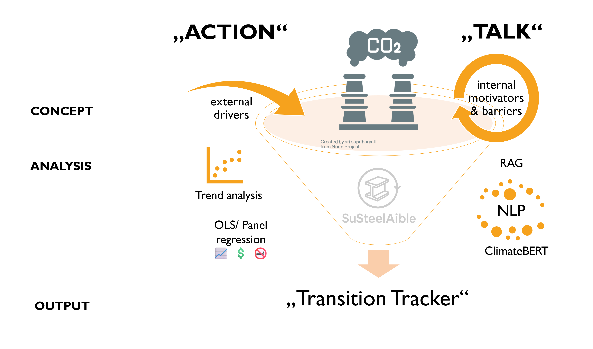

<em>Figure 1: Analytical Approach</em>

Second, the project analyzes **what companies say**. Corporate reports and disclosures are evaluated using ClimateBERT, a language model trained specifically on climate-related texts. This project filters a subset of climate-related texts to assess the strength, specificity, and consistency of decarbonization commitments. To move beyond sentiment and capture substance, Retrieval-Augmented Generation (RAG) is used to extract and structure reported barriers and motivators to decarbonization, including references to capital availability, technology readiness, and infrastructure dependencies. OPUS-MT is employed to ensure consistent analysis across multiple European languages.

By integrating quantitative emissions analysis with systematic evaluation of corporate narratives, SuSteelAible identifies gaps between ambition and execution. These insights are consolidated in the **Transition Tracker**, which maps companies’ relative positioning in the decarbonization process and highlights the conditions associated with observed progress.

## Data Landscape

Building a consistent, company-level dataset required overcoming a central challenge: **no public database provides harmonized emissions data for European steel producers over time**. To address this gap, SuSteelAible constructs a curated dataset through manual extraction of emissions information from 197 corporate disclosures, covering 15 major European steel companies over the period 2013–2024.

The analysis focuses on **15 European steel producers** due to the limited availability of consistent company-level CO₂ emissions data and publicly accessible corporate reports. Restricting the scope to Europe also ensures that the firms operate under a broadly comparable policy and regulatory environment, allowing the study to account for shared frameworks such as EU climate policy and carbon pricing mechanisms.

The core quantitative metric is **emissions intensity per ton of steel produced**, enabling comparison across companies and over time while accounting for differences in production scale. This company-level emissions data is complemented with external contextual variables, including carbon prices, electricity costs, and major policy developments, to capture the broader operating environment in which decarbonization decisions occur.

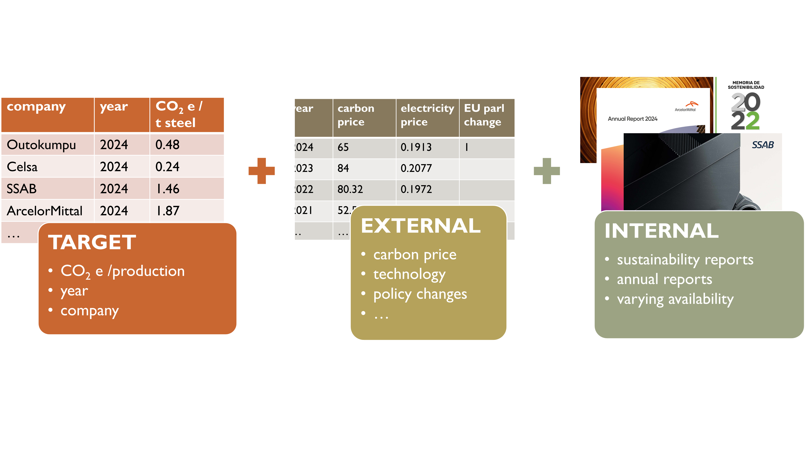

<em>Figure 2: Data Landscape</em>

In parallel, the project assembles a comprehensive corpus of publicly available corporate documents - primarily sustainability reports and annual reports - which form the basis for the narrative and text-based analysis. Linking emissions trajectories with structured analysis of corporate disclosures allows SuSteelAible to jointly examine observed outcomes and stated strategies within a unified analytical framework.

## Emissions Trajectories

Figure 3 shows the evolution of **Scope 1 emissions intensity (tCO₂ per ton of steel)** across European steel producers between 2013 and 2024. Emissions intensities vary substantially across companies, indicating persistent structural differences. For most companies, emissions intensity remains relatively stable over time, with only modest declines or temporary fluctuations rather than sustained downward trends. A small number of companies operate at consistently lower emissions intensity levels, while others remain clustered at the higher end of the distribution. Overall, the data does not indicate significant progress in reducing emissions intensity at the company level, underscoring the challenge of achieving decarbonization through marginal changes alone.

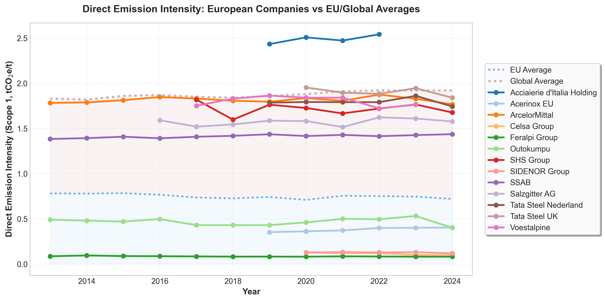

<em>Figure 3: Emissions Intensity of Selected European Producers 2013-24</em>

### What explains the different sets of intensity levels?

The baseline regression model shows that **production technology alone explains approximately 80% of the variation in emissions intensity** across companies. Companies operating **Electric Arc Furnaces (EAF)** - such as Outokumpu and Celsa - exhibit substantially lower emissions intensities than companies relying on **blast furnace–basic oxygen furnace (BF–BOF)** routes, with average emissions roughly **67% lower** in EAF-based production. Predicted emissions intensities cluster around **0.6 tCO₂e per ton of steel for EAF** and **1.8 tCO₂e per ton for BF–BOF**, generating the two distinct intensity sets observed in the data.

While this result confirms the central role of technology, it also reveals a key limitation. Technology explains **where companies are today**, but not **why emissions trajectories change so little over time**. Production routes remain largely fixed throughout the sample period, leading to strong technological lock-in and minimal within-company variation. As a result, the baseline model captures the current emissions landscape well but offers limited insight into the mechanisms that enable - or constrain - transition.

Taken together, the results suggest that decarbonization in the steel industry resembles a **“Big Bang” transition**, in which emissions outcomes are dominated by the centrality of production technology and meaningful change requires discrete technological shifts rather than incremental adjustment.

## Prediction Through External Drivers

To assess how emissions intensity may evolve under different external conditions, the analysis combines panel-based econometric modeling with machine-learning-based prediction. Panel OLS is used to estimate the sensitivity of emissions intensity to key external drivers, including carbon pricing and policy stringency, capturing average responses across companies over time. In parallel, a random forest model is applied to account for nonlinearities and heterogeneous company-level behavior that may not be fully captured by linear specifications. These models are then used to generate forward-looking scenarios reflecting alternative policy and technology pathways.

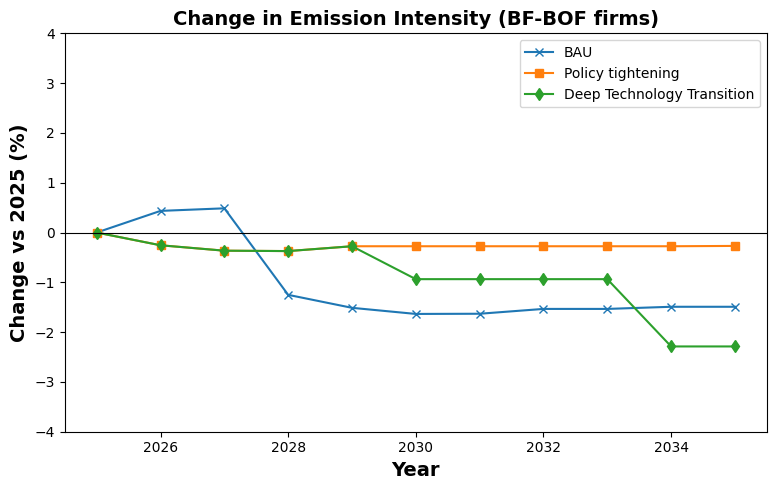

<em>Figure 4: Projected Changes in Emissions Driven by External Drivers</em>

Figure 4 illustrates projected changes in emissions intensity for BF-BOF producers relative to 2025 under three scenarios. Under **business as usual**, emissions intensity declines modestly before stabilizing, reflecting incremental efficiency improvements under existing policy trends. **Policy tightening**, characterized by reduced free allowances and gradually increasing regulatory pressure, leads to slightly stronger but still limited reductions over time. In contrast, the **technology transition** scenario - representing strict carbon regulation combined with a shift toward hydrogen-compatible production - produces a markedly steeper decline, particularly in the later years of the projection. Together, the scenarios highlight how external drivers shape near- and medium-term emissions trajectories, while underscoring the difference between incremental adjustment and structural change.

## From Emissions to Narratives: Extracting Climate Signals from Corporate Reports

To complement the analysis of operational emissions, the second part of the project systematically examines how steel producers communicate about climate and decarbonization in their public reports. In total, **197 annual and sustainability reports from 15 companies** were collected and pre-processed to create a structured text corpus covering the period 2013–2024. The documents were converted into machine-readable format, cleaned, standardized, translated and segmented into paragraph-level text units to ensure comparability across companies, reporting formats, and years.

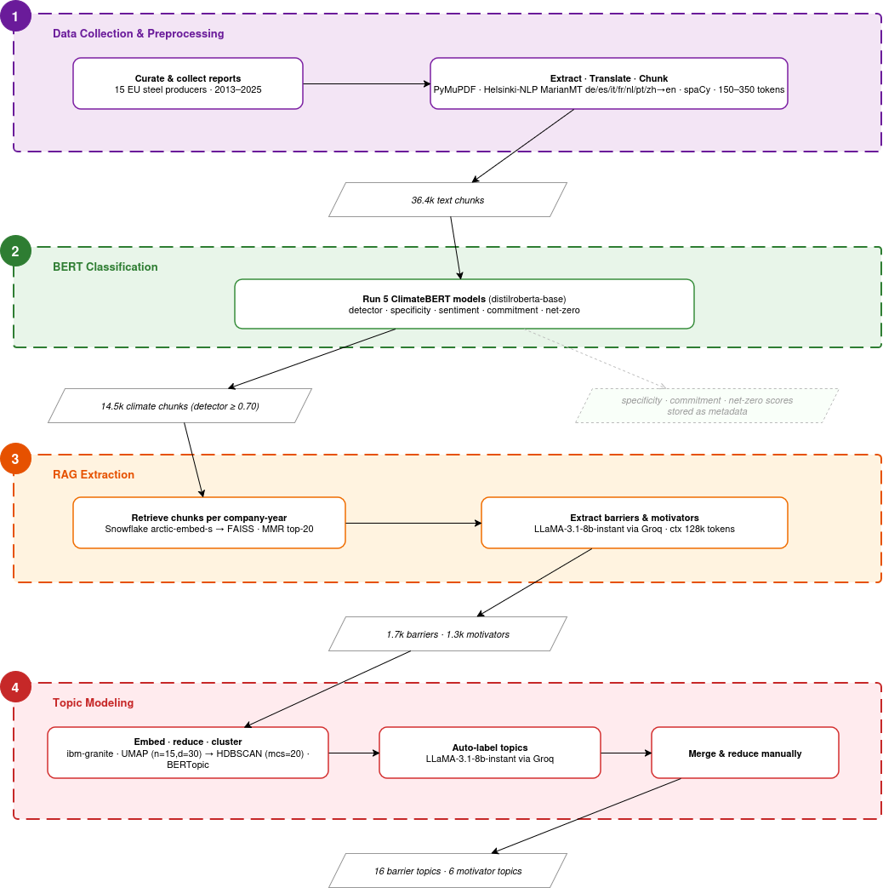

<em>Figure 5: NLP workflow</em>

To systematically analyze corporate climate communication, the project uses **ClimateBERT**, a transformer-based language model specifically fine-tuned on climate-related text corpora. ClimateBERT identifies and classifies passages related to climate topics within corporate reports and assigns multiple analytical scores that capture how companies communicate about the transition. In particular, the model evaluates **sentiment framing** (opportunity, neutral, or risk), **linguistic specificity** (the degree to which statements contain concrete operational or technological detail), and **commitment intensity** (the strength of forward-looking language related to targets, pledges, or planned actions). These dimensions are particularly relevant for the present study because they distinguish between general sustainability rhetoric and more operationally meaningful descriptions of decarbonization strategies. In this way, ClimateBERT enables the transformation of qualitative corporate reports into measurable indicators of transition discourse.

Within the ClimateBERT analysis, **net-zero classifications** serve as a signal of transition-oriented climate discourse. Because references to net-zero commitments typically contain the most concrete descriptions of decarbonization pathways - including technology choices, investment plans, and emissions targets - they provide an indicator of how explicitly companies articulate their decarbonization strategies within broader climate reporting.

Figure 6 illustrates the structural evolution of corporate climate communication. The left panel presents a content “funnel”, showing total report volume, the subset classified as climate-related, and the further subset focused explicitly on net-zero themes. Over time, both the absolute number and the relative share of climate-related text increase substantially, particularly after 2018. The right panel shows focus ratios: the share of total reporting devoted to climate topics rises from roughly one-third of report content in the early years to more than half by 2024. At the same time, net-zero–specific content grows both as a share of total reporting and as a share of climate-related discussion, indicating increasing strategic centrality of long-term decarbonization language.

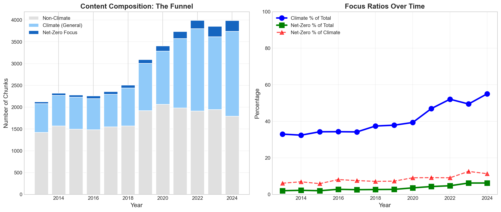

<em>Figure 6: Evolution of Climate Communication</em>

Finally, the extracted climate-related corpus was used as input for **Retrieval-Augmented Generation (RAG)** to systematically identify and structure reported motivators and barriers to decarbonization. By combining semantic retrieval with guided generation, RAG enables consistent extraction and categorization of transition-related mechanisms across companies and time. In addition, **topic modeling** was applied to the identified motivators and barriers to detect recurring thematic clusters and trace how the structure of reported transition challenges evolved throughout the sample period. This layered pipeline moves from unstructured text to structured, comparable insight into how companies frame and rationalize their decarbonization efforts.

### Trends in Climate-Related Sentiment

To assess how the tone of corporate climate communication has evolved, the analysis uses **ClimateBERT** to classify climate-related statements in corporate reports into three categories: opportunity, neutral, and risk. Figure 7 shows the aggregate share of climate-related text assigned to each category over time, expressed as a percentage of total climate-relevant content.

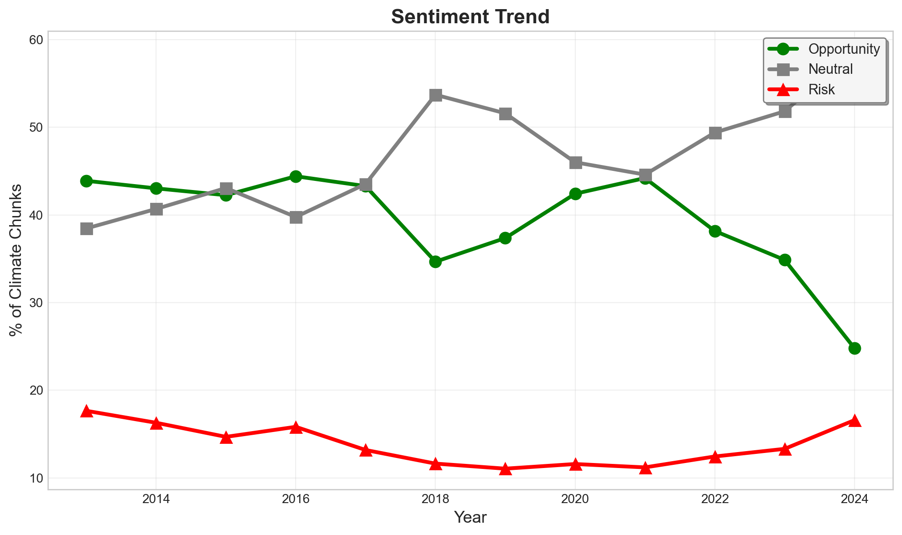

<em>Figure 7: Sentiment Trend</em>

In the early years (2013–2016), climate discourse is predominantly framed as a **business opportunity**, accounting for roughly 42–44% of climate-related text. Neutral reporting remains slightly below this level, while risk-oriented language represents a smaller share, typically between 15–18%. Beginning around 2018, a noticeable shift occurs: neutral communication increases sharply, peaking above 50% of climate-related content, while opportunity-oriented framing declines.

From 2020 onward, opportunity language partially recovers but never returns to its earlier dominance. By 2024, opportunity-focused sentiment falls to its lowest level in the sample, while **risk-related language increases again**, reversing its earlier downward trend. Overall, Figure 6 indicates a structural transition in climate discourse: early opportunity-driven narratives give way to more neutral, compliance-oriented communication, followed by a gradual re-emergence of risk awareness. This pattern suggests a maturing and increasingly complex discussion, reflecting both institutionalization of reporting standards and heightened sensitivity to risks.

### Lexical Structure of Climate Communication

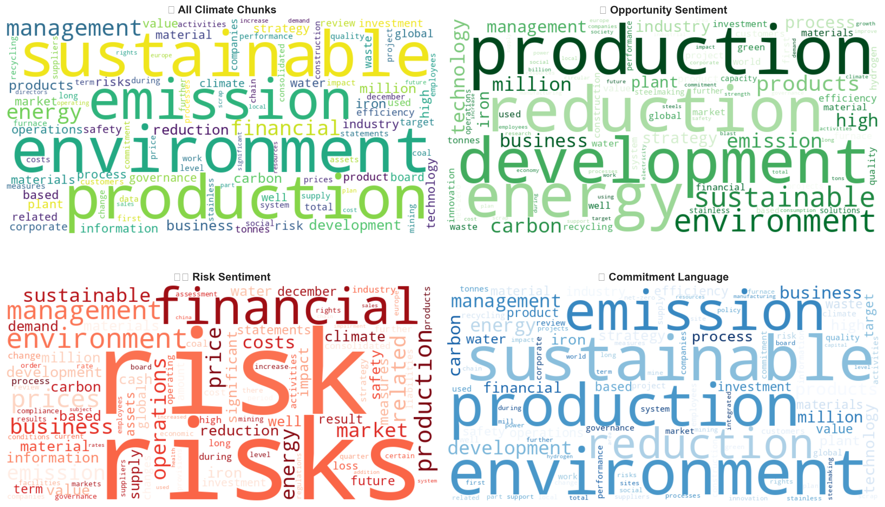

<em>Figure 8: Wordclouds</em>

To complement the quantitative sentiment classification, Figure 8 visualizes the lexical composition of climate-related communication using word frequency distributions across sentiment categories. The upper-left panel shows all climate-related text, while the remaining panels isolate opportunity-, risk-, and commitment-oriented language as classified by ClimateBERT.

Across all climate content, dominant terms include sustainable, emission, production, and environment - reflecting the strong operational framing of climate issues within steelmaking. Opportunity-oriented language emphasizes terms such as development, energy, technology, and innovation, suggesting a strategic framing of decarbonization as modernization and growth. In contrast, risk-related discourse is heavily centered around financial, costs, price, and market - indicating that climate challenges are frequently articulated through economic exposure and competitiveness concerns. Commitment-oriented language clusters around reduction, target, and management - reflecting formalized transition planning and governance structures.

Together, these lexical patterns reinforce the quantitative findings: climate communication in the steel sector combines operational sustainability narratives with financial risk considerations and increasingly formalized commitment language. The word distributions illustrate how companies frame decarbonization simultaneously as an industrial modernization project, a financial challenge, and a strategic obligation.

### Net-Zero as High-Signal Climate Communication

To assess whether net-zero communication meaningfully differs from general climate communication, Figure 9 compares average **specificity and commitment intensity scores** for net-zero–classified text versus broader climate-related text over time.

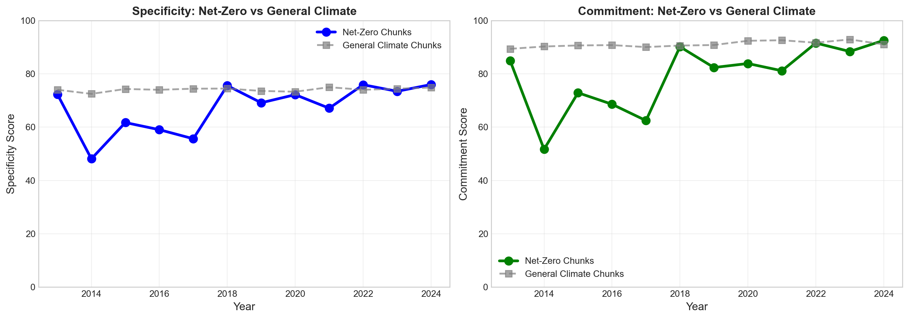

<em>Figure 9: Specificity and Commitment Intensity Scores</em>

The left panel shows that net-zero passages consistently exhibit higher or comparable levels of linguistic specificity relative to general climate content, particularly from 2018 onward. While general climate reporting remains relatively stable in specificity, net-zero language becomes more detailed and operationally explicit over time, indicating increasing precision in how companies describe transition pathways.

The right panel compares commitment scores. Net-zero passages display greater volatility in the early years but converge toward the high commitment levels observed in general climate reporting after 2018. In recent years, net-zero text reaches similarly elevated commitment intensities, suggesting that decarbonization language has become increasingly formalized and target-oriented.

Together, the results confirm that net-zero text constitutes a structurally distinct and analytically meaningful subset of climate communication. It combines forward-looking transition framing with comparatively high specificity and commitment intensity, supporting its use as a focused corpus for subsequent extraction of motivators and barriers through RAG.

### Barriers to Decarbonization Narrated in Reports

To examine how companies describe barriers and motivators to decarbonization, the analysis applies **Retrieval-Augmented Generation (RAG)** to systematically extract and classify reported constraints from the climate-related filtered corporate reports. Rather than relying solely on predefined categories, this approach first generates structured textual representations of barriers and motivators to decarbonization.

**Barriers** refer to factors that constrain or slow the implementation of decarbonization strategies in the steel industry. In this project, barriers are defined as technological, economic, regulatory, or infrastructural conditions that firms identify in their disclosures as limiting the feasibility, speed, or scale of emissions reductions.

**Motivators** refer to factors that encourage or enable firms to pursue decarbonization efforts. These include strategic, technological, regulatory, and market-related drivers that companies describe as supporting emissions reductions, investment in low-carbon technologies, or broader sustainability transformation.

In a first analytical step, the extracted barrier statements were subjected to **unsupervised topic modeling** to identify latent thematic structures within the corpus. Figure 10 visualizes this initial topic landscape as a two-dimensional embedding of barrier statements. Each cluster represents semantically related passages, with proximity indicating thematic similarity. At this exploratory stage, clusters form around recurring concepts such as carbon pricing and implementation costs, low-carbon energy availability, hydrogen production constraints, carbon capture technologies, certification and carbon footprint labeling, and industrial process transformation. The dispersion of clusters highlights the diversity of reported obstacles and reveals that decarbonization challenges are not concentrated in a single domain but distributed across regulatory, technological, infrastructural, and market dimensions.

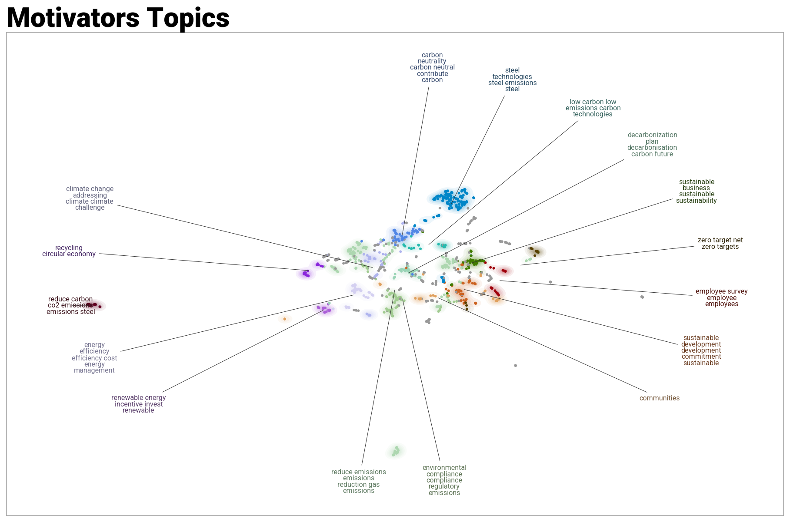

<em>Figure 10: Topic Landscape of Barriers</em>

Building on this exploratory structure, a second modeling step consolidates and refines the topics into more interpretable and stable thematic groups. Figure 11 shows this structured barrier architecture with clearer labeling and reduced overlap between clusters. Key themes emerge more distinctly: carbon pricing and regulatory costs; energy intensity and electricity constraints; carbon capture and industrial process transformation; hydrogen infrastructure and resource availability; certification and carbon footprint reporting; and broader decarbonization policy frameworks. Compared to the first map, the refined clustering improves interpretability by aggregating closely related subtopics into coherent barrier categories while preserving semantic differentiation.

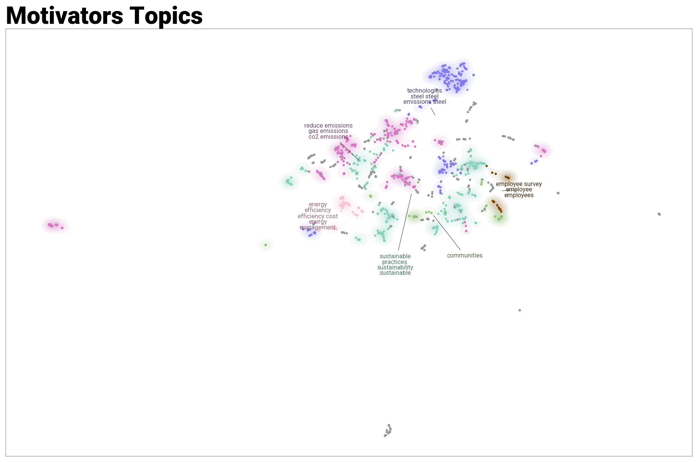

<em>Figure 11: Reduced Topic Landscape of Barriers</em>

Substantively, the spatial separation of energy- and hydrogen-related clusters from carbon pricing and policy clusters suggests that companies distinguish between **regulatory exposure and technical feasibility constraints**. Similarly, certification and labeling topics form their own identifiable group, indicating that reporting and verification challenges constitute a distinct layer of transition complexity. Together, the two-step topic modeling process demonstrates that corporate narratives of decarbonization barriers are multidimensional, evolving from dispersed thematic fragments into a structured architecture of transition constraints.

This layered approach — RAG extraction followed by exploratory and then consolidated topic modeling - moves the analysis beyond frequency counts. It reveals how companies cognitively organize decarbonization challenges and shows that regulatory, technological, energy-system, and market barriers operate as interconnected but distinguishable domains within corporate reports.

**Motivators to Decarbonization Narrated in Reports**

In parallel to the barrier analysis, the extracted climate-related corpus was analyzed to identify **reported motivators** for decarbonization. Using the same Retrieval-Augmented Generation (RAG) pipeline, passages explicitly referring to drivers, incentives, or enabling factors were systematically extracted and structured. This ensures methodological symmetry between constraints and enablers, allowing direct comparison of how companies narrate obstacles versus drivers of transition.

As a first step, the extracted motivator statements were subjected to **unsupervised topic modeling** to uncover latent thematic structures. Figure 12 visualizes this initial motivator landscape as a two-dimensional semantic embedding. Distinct clusters emerge around themes such as emissions reduction targets, carbon neutrality commitments, low-carbon technologies, renewable energy investment, energy efficiency, circular economy practices, sustainability strategies, employee engagement, and community relations. The relative proximity of many clusters indicates that motivators are often framed as interconnected elements of a broader sustainability narrative rather than isolated drivers.

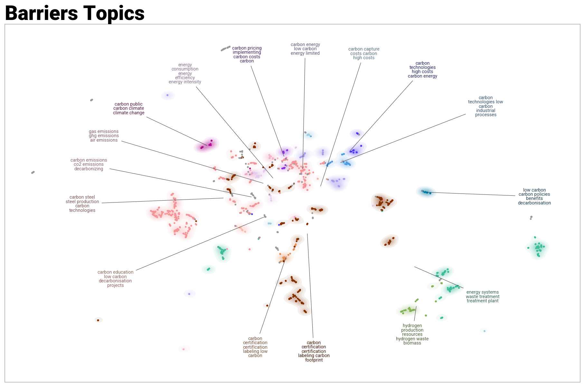

<em>Figure 12: Topic Landscape of Motivators</em>

In a second step, the topic model was refined to consolidate closely related clusters into more coherent and interpretable thematic groups. Figure 13 shows this structured motivator architecture with clearer separation between core themes. Prominent clusters include: emissions reduction and CO₂ targets; technological innovation and low-carbon steel processes; energy efficiency and management improvements; sustainability practices and corporate strategy; employee and organizational engagement; and community and stakeholder relations. Compared to the initial exploratory map, the refined structure reduces fragmentation and clarifies how companies organize enabling factors within their decarbonization communication.

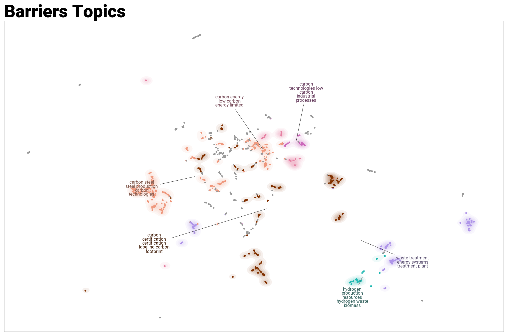

<em>Figure 13: Reduced Topic Landscape of Motivators</em>

Substantively, the spatial organization of motivator topics differs from the barrier map in an important way. While barriers tend to separate into clearly distinct regulatory, technological, and infrastructural domains, motivators cluster more centrally and densely, suggesting stronger conceptual integration. Emissions reduction goals, technological modernization, and sustainability strategy appear tightly linked, reflecting a narrative in which decarbonization is framed as a coordinated strategic transformation rather than a single policy response. The proximity of employee and community clusters further indicates that companies embed transition efforts within broader organizational and stakeholder frameworks.

Together, the two-step modeling process reveals that corporate narratives of decarbonization drivers are structured around ambition, modernization, and strategic alignment. When contrasted with the barrier architecture, this highlights a central asymmetry: companies describe constraints as externally imposed and structurally segmented, whereas motivators are framed as internally integrated and strategically aligned components of long-term transformation.

### Temporal Evolution of Barriers and Motivators

To complement the structural topic maps presented above, the extracted barriers and motivators were also analyzed **over time** to identify how the emphasis of different themes evolved across the reporting period (2013–2024). Figures 14 and 15 track the annual frequency of the most prominent topics identified through topic modeling, allowing the analysis to move from a static topic structure to a dynamic view of how decarbonization narratives developed.

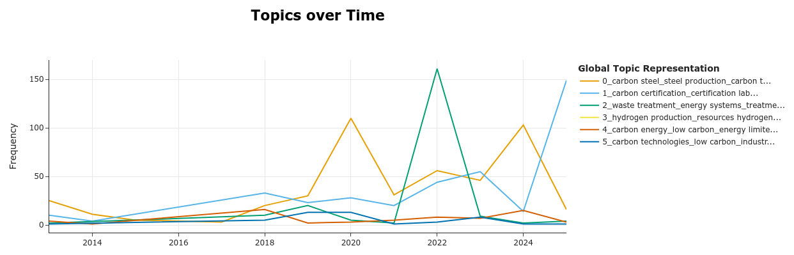

<em>Figure 14: Stated Barriers Over Time</em>

For **barriers**, several themes emerge intermittently rather than following smooth trajectories. Early years show relatively low and fragmented reporting of transition constraints, reflecting the still limited prominence of decarbonization in corporate reporting. Beginning around **2019–2020**, however, barrier narratives intensify noticeably. Topics related to **steel production technologies and carbon-intensive processes** increase sharply, indicating growing awareness of the structural challenges associated with transforming BF–BOF production systems. At the same time, **carbon certification and labeling frameworks** gain importance, suggesting that companies increasingly anticipate future regulatory and reporting requirements. A pronounced spike around 2022 appears in topics associated with **energy systems and resource availability**, which aligns with the broader European energy crisis and the emerging recognition that low-carbon energy supply - particularly hydrogen and renewable electricity - constitutes a central constraint for industrial decarbonization.

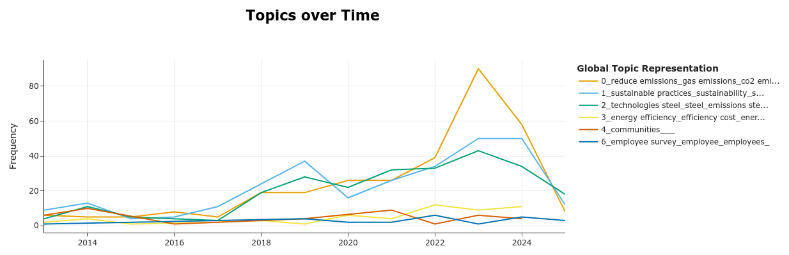

<em>Figure 15: Stated Motivators Over Time</em>

The temporal pattern of **motivators** shows a different dynamic. Rather than appearing sporadically, enabling factors gradually **intensify over time**, suggesting a progressive consolidation of transition narratives. Topics related to emissions reduction targets and **corporate decarbonization commitments** grow steadily and peak in the early 2020s, reflecting the increasing institutionalization of net-zero strategies following the Paris Agreement and the EU Green Deal. At the same time, themes related to **sustainability practices and corporate strategy** expand significantly after 2018, indicating that decarbonization becomes more deeply embedded in broader corporate transformation agendas. Technological innovation and energy efficiency improvements also gain prominence, reflecting companies’ efforts to frame decarbonization not only as a regulatory response but as an opportunity for industrial modernization.

Taken together, the two figures reinforce the structural findings from the topic maps. **Barriers appear episodic and externally driven**, often reacting to regulatory changes, energy system constraints, or technological uncertainties. **Motivators, by contrast, show a more gradual and cumulative evolution**, reflecting the increasing integration of decarbonization into corporate strategy and long-term planning. This asymmetry mirrors the broader narrative identified throughout the project: companies tend to describe barriers as external shocks or structural limits, while motivators are framed as internally coordinated strategic initiatives.

Importantly, the temporal dynamics also align with the earlier findings from the **sentiment analysis and the Transition Tracker**. The growth of motivator topics coincides with the increasing volume and specificity of climate-related reporting, while spikes in barrier narratives correspond to periods of heightened uncertainty in energy markets and regulatory frameworks. Together, these results suggest that corporate climate communication evolves in response to both **policy signals and technological developments**, with narrative emphasis shifting as the industrial transition unfolds.

## Transition Tracker: Linking Action and Communication

To move beyond emissions levels alone, SuSteelAible introduces a **Transition Tracker** that jointly evaluates operational progress (**ACTION**) and climate content (**COMMUNICATION**). Rather than treating emissions as the sole indicator of transition, the framework captures both measurable decarbonization performance and the quantity of climate communication.

### ACTION: Measuring Operational Readiness and Momentum

The ACTION score is a **100-point composite index** designed to approximate decarbonization readiness at the company level. It integrates five dimensions:

| **Dimension** | **Weight** | **Measure** |
|---------------|------------|-------------|
| **Performance** | 30 pts | *Current emissions intensity relative to a 2 tCO₂e/t benchmark* |
| **Trend** | 30 pts | *Annual intensity improvement rate with statistical significance (R² ≥ 0.5)* |
| **Data Quality** | 15 pts | *Reporting completeness and length of time series* |
| **Technology** | 20 pts | *Current production technology and stated transition plans (e.g., H₂-DRI pilots)* |
| **Renewables** | 5 pts | *Renewable electricity procurement (EAF companies only)* |

This structure ensures that ACTION captures not only where a company stands today, but also whether it is **improving, investing, and building viable foundations** for transformation.

Importantly, this composite structure addresses a key measurement challenge: even when emissions remain structurally high due to BF-BOF dependence, companies investing in hydrogen pilots or demonstrating improvement trends receive measurable credit for transition readiness.

To track transition acceleration, the framework compares two periods: **2013-2019 (pre-Green Deal/CBAM)** and **2020-2024 (post-Green Deal/CBAM)**. Action scores are calculated independently for each period using the same methodology, revealing whether companies accelerated decarbonization efforts following major policy shifts.

### COMMUNICATION: Measuring Climate Content

Climate **COMMUNICATION** is measured using ClimateBERT analysis of sustainability and annual reports, calculating the **percentage of report content devoted to climate-related topics (0–100%)**. This metric captures the **volume and prominence of climate discourse** in corporate reporting. Like ACTION, climate COMMUNICATION scores are calculated for both the **2013–2019** and **2020–2024** periods to track how corporate narratives evolve over time.

In addition to measuring overall climate volume, the analysis also considers **net-zero–specific language** as a complementary indicator of explicit decarbonization commitments. While climate communication captures the breadth of sustainability discourse, net-zero references signal **more concrete transition framing**, such as emissions targets, technology pathways, or investment plans. Comparing these two measures helps distinguish between **general climate visibility** in reporting and the articulation of **specific decarbonization commitments**.

### Mapping Companies in Action-Communication Space

The Transition Tracker plots companies along the **ACTION** and **COMMUNICATION** dimensions for both time periods. The animation shows how companies moved between **2019 and 2024**, revealing heterogeneous transition trajectories across four distinct quadrants:

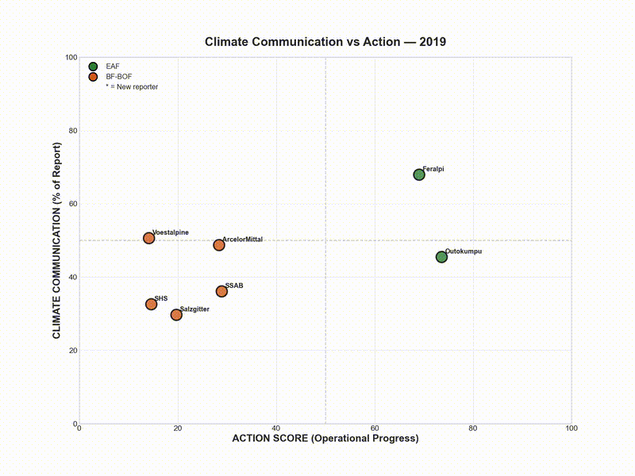

<em>Animation 1: communication vs action</em>

**Upper Right (High Communication, High Action)**
Primarily EAF companies throughout both periods. By 2024, this quadrant includes companies demonstrating alignment between climate communication volume and operational performance.

**Upper Left (High Communication, Lower Action)**
In 2019, includes both BF-BOF companies (Voestalpine, ArcelorMittal, SSAB) and one EAF company (Feralpi). By 2024, several new reporters appear here (Acciaierie, Tata NL, marked with *), alongside companies that increased communication substantially while action scores remained below 50. This pattern may reflect early-stage transformation where narrative precedes infrastructure investments, or strategic positioning in response to regulatory pressure.

**Lower Right (Lower Communication, High Action)**
Occupied by Outokumpu in 2019, demonstrating high operational performance (action >80) with moderate climate communication (~45%). By 2024, Outokumpu moves upward and rightward, exiting this quadrant.

**Lower Left (Lower Communication, Lower Action)**
In 2019, contains several BF-BOF companies (Salzgitter, SHS, SSAB) with both communication and action scores below 50. By 2024, while all companies increased climate communication (moving upward), several BF-BOF companies remain here despite the vertical shift - their action scores stay below 50 even as they discuss climate more extensively. This indicates increased narrative engagement without corresponding operational transformation.

Importantly, the trajectory lines illustrate how individual firms **move across the Action–Communication space over time** rather than simply occupying static positions. Most companies gradually increase their ACTION scores while simultaneously expanding climate-related reporting. However, when comparing **general climate discourse** with **net-zero–specific language**, the overall volume differs substantially while the movement patterns are largely parallel. Both metrics show upward movement between 2019 and 2024, but net-zero content represents a smaller subset of overall climate communication - companies dedicate 10-20% of reports to net-zero topics compared to 40-70% for general climate content. This lower baseline reflects that net-zero language is more targeted, focusing specifically on long-term decarbonization commitments, technology pathways, and emissions targets rather than broader sustainability themes. The similar trajectory patterns suggest that climate communication expansion and net-zero articulation occur in tandem, though the latter remains more concentrated and specific.

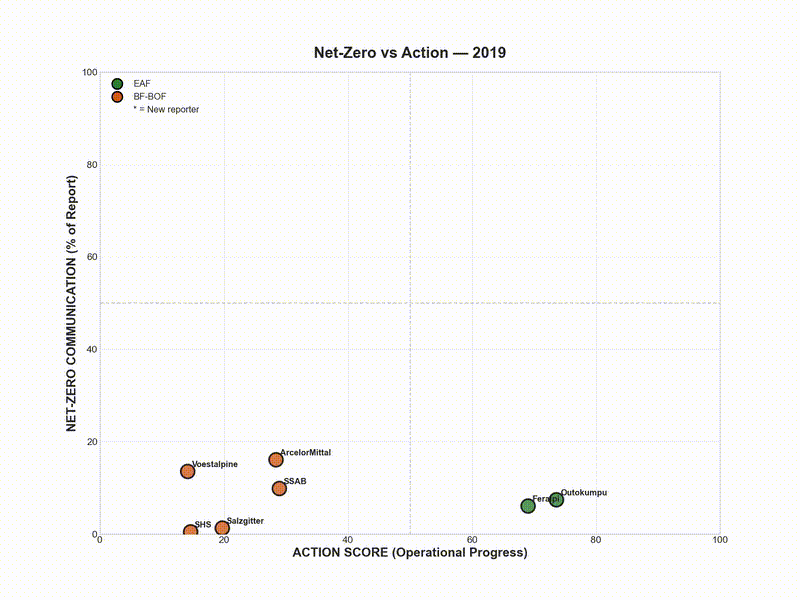

<em>Animation 2: netzero vs action</em>

#### **Key Patterns (2019 → 2024)**

**The Technology Divide**
EAF companies (green) cluster on the **right side** of the chart (ACTION > 50), while BF–BOF companies (orange) cluster on the **left** (ACTION < 50). This spatial separation visualizes **technology lock-in**: traditional steelmakers face structural barriers to achieving high ACTION scores regardless of their climate commitments.

**Universal Climate Communication Increase**
Nearly all companies move **upward**, increasing climate communication by roughly **10–20 percentage points**. This reflects the mainstreaming of climate discourse across the sector, driven by stakeholder expectations, disclosure frameworks, and regulatory developments such as the **EU Green Deal and CBAM**.

Together, these trajectories illustrate that while climate discourse has expanded across the entire industry, **operational decarbonization progress remains strongly shaped by underlying production technologies**. This reinforces the earlier finding that steel decarbonization resembles a **“Big Bang” transition**: meaningful emissions reductions depend on discrete technological shifts - such as the move from BF–BOF to hydrogen-based or electric production routes - rather than gradual improvements in communication or incremental operational adjustments.

### Interpretation

At the aggregate level, emissions remain relatively flat - consistent with the technological lock-in identified earlier. However, the Transition Tracker reveals that transition activity is occurring beneath the surface. Improvements in data transparency, early-stage hydrogen deployment, renewable electricity procurement, and stronger target articulation indicate incremental but tangible progress.

The visualization suggests that external pressures drive climate communication relatively uniformly across firms, while internal structural factors—particularly technology choices and capital intensity — largely determine operational progress. The persistent technology divide between EAF and BF–BOF producers confirms that structural technology transformation, rather than incremental efficiency gains, is required to move firms from the left to the right side of the action dimension.

Decarbonization in the steel sector therefore appears neither linear nor uniform. Structural transitions—especially for BF–BOF systems—require capital-intensive investments and long technological development cycles that do not immediately translate into observable emissions reductions. As hydrogen-based production pathways move from pilot projects toward commercial deployment, measurable improvements in emissions intensity may follow with a lag.

By integrating operational metrics with narrative analysis across two distinct time periods, the Transition Tracker provides a more nuanced view of transition readiness—capturing both ambition and execution, and distinguishing between rhetorical alignment and structural change.

## Insights & Future Work
This project highlights both the analytical potential and the structural limitations of studying industrial decarbonization using publicly available data. Despite targeted outreach, neither major data-holding organizations nor most steel producers provided consistent, company-level CO₂ emissions data, requiring extensive manual data collection. As a result, the available data remain sparse, uneven in quality, and often confidential at the plant level, constraining comparability and the depth of longitudinal analysis. These limitations underscore a broader challenge: **robust analysis of industrial decarbonization is not possible without improved data transparency and collaboration between companies, regulators, and data providers**.

At the same time, the findings reinforce that decarbonization in the steel industry is a long-term process. Emissions outcomes respond slowly, even under rising carbon prices and increasing regulatory pressure, and meaningful change depends on capital-intensive technological transitions that unfold over decades. Interpreting these dynamics requires not only quantitative tools but also **domain knowledge of steelmaking technologies, energy systems, and policy design**—without which results risk being misread or oversimplified.

A key next step for research on industrial decarbonization is the **systematic expansion of high-quality, company-level emissions and disclosure data**. Many of the analytical approaches applied in this project — particularly machine learning–based prediction models and language-model methods such as LLM-driven extraction or Retrieval-Augmented Generation (RAG) — perform best when applied to large, consistent datasets. At present, however, company-level emissions data in heavy industry remain sparse, fragmented, and often confidential, limiting the reliability and scalability of such techniques.

Expanding datasets both **temporally and geographically** would enable more robust modeling of decarbonization pathways and allow comparative analysis across different regulatory environments, energy systems, and technology adoption patterns. In addition, translating analytical frameworks such as the Transition Tracker into **interactive and continuously updated platforms** could help bridge the gap between research and practice, enabling policymakers, investors, and industry stakeholders to monitor transition dynamics in near real time.

Ultimately, improving data availability and accessibility is a prerequisite for leveraging advanced analytical tools at scale and for developing more reliable insights into the complex dynamics of industrial decarbonization.

