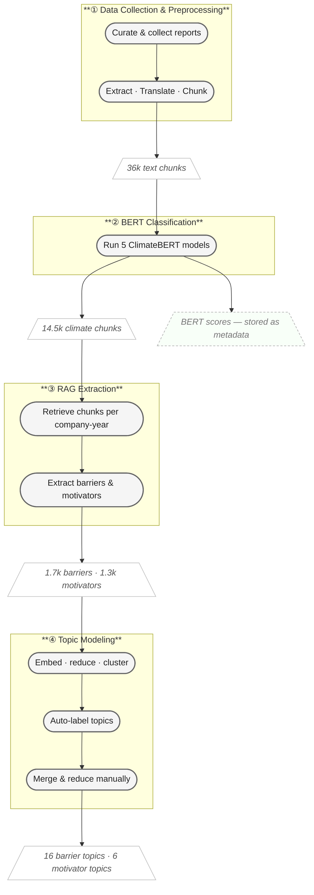
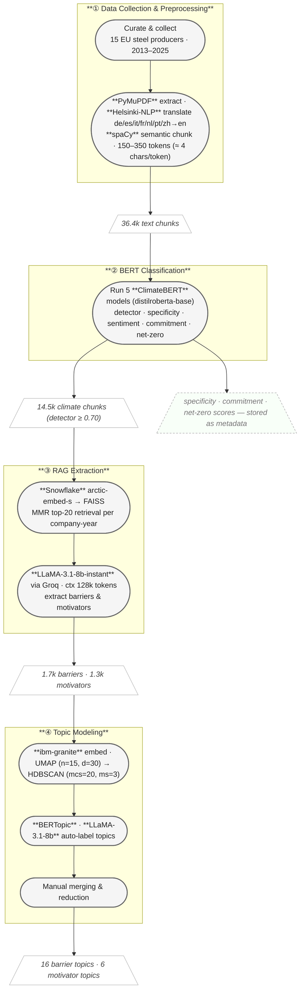

# NLP Pipeline — Technical Specifications

---

## A. Pipeline Schema

*High-level overview — see Section C for full technical specs.*



---

## B. Detailed Pipeline Diagram

*Self-contained with model names, parameters and data volumes.*


    BD --> R1
    R1 --> TM1 --> TM2

    classDef corpus fill:#ede0f7,stroke:#8e44ad,stroke-width:2px,color:#333
    classDef prep fill:#d6eaf8,stroke:#2471a3,stroke-width:2px,color:#333
    classDef bert fill:#d5f5e3,stroke:#1e8449,stroke-width:2px,color:#333
    classDef bertside fill:#eafbf1,stroke:#1e8449,stroke-width:1px,stroke-dasharray:4 3,color:#555
    classDef rag fill:#fef9e7,stroke:#d68910,stroke-width:2px,color:#333
    classDef topic fill:#fde8e8,stroke:#cb4335,stroke-width:2px,color:#333

    class DC,PDF,PP corpus
    class BD bert
    class BS bertside
    class R1 rag
    class TM1,TM2 topic
```

---

## C. Technical Specifications

### C.1 Corpus

| Parameter | Value |
|---|---|
| Companies | 15 EU steel producers |
| Reports (PDFs) | 197 (180 unique files, some multi-document per company-year) |
| Year range | 2013 – 2025 |
| Report types | Annual, sustainability, integrated annual, non-financial, climate action |

### C.2 Preprocessing

| Parameter | Value |
|---|---|
| PDF library | PyMuPDF (fitz) |
| Language detection | `langid` |
| Translation | Helsinki-NLP MarianMT (de/es/it/fr/nl/pt/zh → en) |
| Sentence splitting | spaCy `en_core_web_sm` |
| Chunking method | Semantic (sentence-boundary-aware) |
| Target chunk size | 600 – 1 400 chars (≈ 150 – 350 tokens) |
| Observed chunk sizes | min 38 / median 1 454 / avg 1 751 / max 19 629 chars (≈ 10 / 360 / 440 / 4 900 tokens) |
| Total chunks after preprocessing | 36 444 |
| Chunks passing climate filter (detector ≥ 0.70) | 14 545 |

### C.3 BERT Classification (ClimateBERT)

All models are fine-tuned variants of `distilroberta-base`.

| Model | HuggingFace ID | Purpose |
|---|---|---|
| Detector | `climatebert/distilroberta-base-climate-detector` | Climate relevance binary classifier |
| Specificity | `climatebert/distilroberta-base-climate-specificity` | Specific vs. general claim |
| Sentiment | `climatebert/distilroberta-base-climate-sentiment` | Positive / neutral / negative |
| Commitment | `climatebert/distilroberta-base-climate-commitment` | Commitment strength |
| Net-zero | `climatebert/netzero-reduction` | Net-zero / reduction focus |

| Filter | Value |
|---|---|
| Detector score threshold | ≥ 0.70 |
| Chunks passing filter | 14 545 / 36 444 (39.9 %) |

### C.4 RAG Extraction

| Parameter | Value |
|---|---|
| Embedding model | `Snowflake/snowflake-arctic-embed-s` |
| Vector store | FAISS |
| Retrieval strategy | MMR (max marginal relevance) |
| MMR fetch_k | 50 |
| MMR lambda | 0.2 (diversity-heavy) |
| top_k per query | 20 |
| Queries per category | 3 (different semantic angles) |
| Retrieval scope | Per company-year |
| LLM provider | Groq |
| LLM model | `llama-3.1-8b-instant` |
| Context window | 128 000 tokens |
| LLM temperature | 0.0 |
| Barriers extracted | 1 698 (across 15 companies) |
| Motivators extracted | 1 255 (across 15 companies) |

### C.5 Topic Modeling (BERTopic)

| Parameter | Value |
|---|---|
| Embedding model | `ibm-granite/granite-embedding-english-r2` |
| Embedding batch size | 64 |
| UMAP n_neighbors | 15 |
| UMAP n_components | 30 |
| UMAP min_dist | 0.05 |
| UMAP metric | cosine |
| HDBSCAN min_cluster_size | 20 |
| HDBSCAN min_samples | 3 |
| HDBSCAN metric | euclidean |
| HDBSCAN cluster selection | EOM |
| CountVectorizer n-gram range | (1, 2) |
| CountVectorizer min_df | 2 |
| CountVectorizer max_df | 0.92 |
| MMR diversity (representation) | 0.4 |
| Top-n keywords per topic | 10 |
| Outlier reduction | Yes (embedding-based) |

| Result | Barriers | Motivators |
|---|---|---|
| Documents fed in | 1 636 | 1 227 |
| Topics before merging | 26 | 19 |
| Outliers (topic −1) | 167 (10.2 %) | 250 (20.4 %) |
| Topics after merging | 16 | 6 |

### C.6 Topic Labeling

| Parameter | Value |
|---|---|
| LLM provider | Groq |
| LLM model | `llama-3.1-8b-instant` |
| Temperature | 0.0 |
| Input | c-TF-IDF keywords (statistical, no LLM in extraction) |
| Output | One label per topic, batch call |
